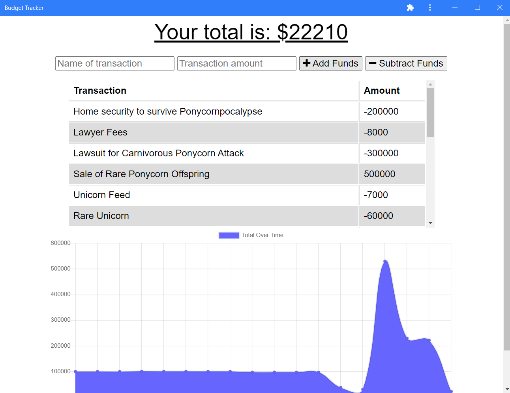

# Budget Tracker

## Description 

Budget Tracker allows users to track deposits and withdrawals, even without an internet connection. It can be downloaded onto your device as a progressive web application.

---

## Table of Contents 

- [Built With](#built-with)
- [Installation](#installation)
- [Usage](#usage)
- [Contributors](#contributors)
- [Acknowledgements](#acknowledgements)

---

## Built With

---

## Installation

This app is for demonstration only and is not intended for individual use in its current version. You can download the PWA by using the provided link and clicking on the option to install app. The location of that option will vary by device and browser. Check your browser options or the bottom of the app. 

[Back to Contents](#table-of-contents)

---

## Usage

As stated above, this app is for demonstration only and is not intended for individual use in its current version. You may add deposits or make withdrawals, but only on using the provided demo database.

[Back to Contents](#table-of-contents)
  
---

## Contributors

---
---
    
### Craig Bennett

- Service worker
- idb.js (IndexedDB)
- manifest

[Craig5117](https://github.com/Craig5117)

---
---

[Back to Contents](#table-of-contents)

## Acknowledgements

- [Tech badges by Ileriayo](https://github.com/Ileriayo/markdown-badges)
- [Mongoose](https://mongoosejs.com/)
- [Express.js](https://www.npmjs.com/package/express)

[Back to Contents](#table-of-contents)